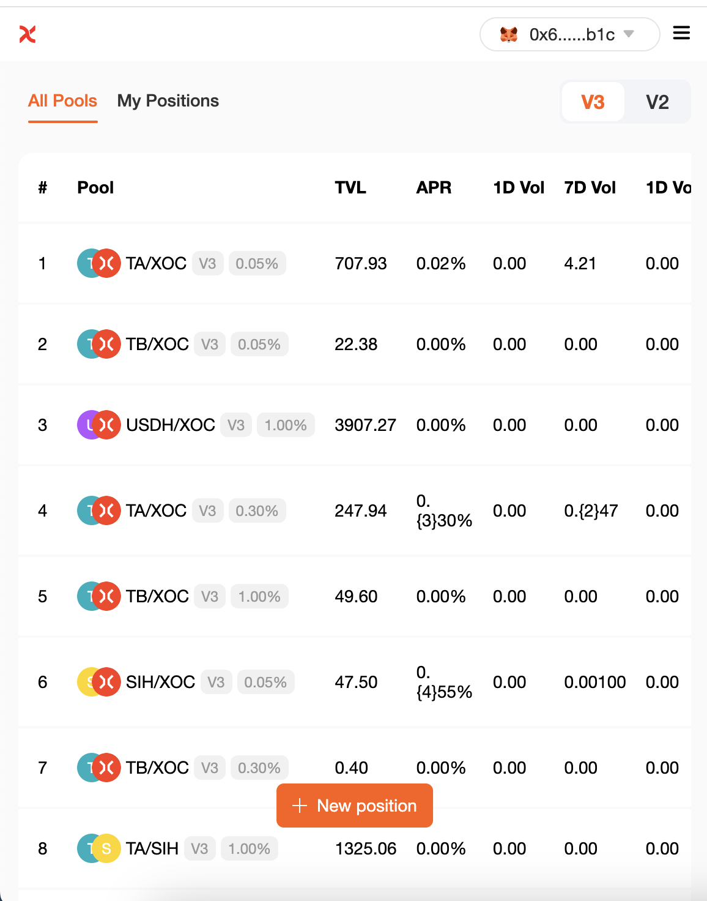
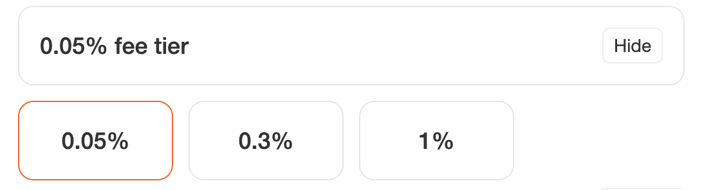
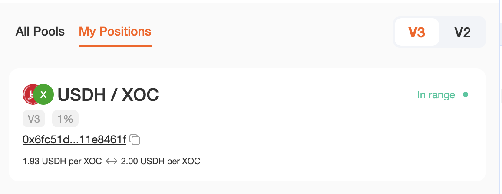
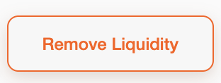
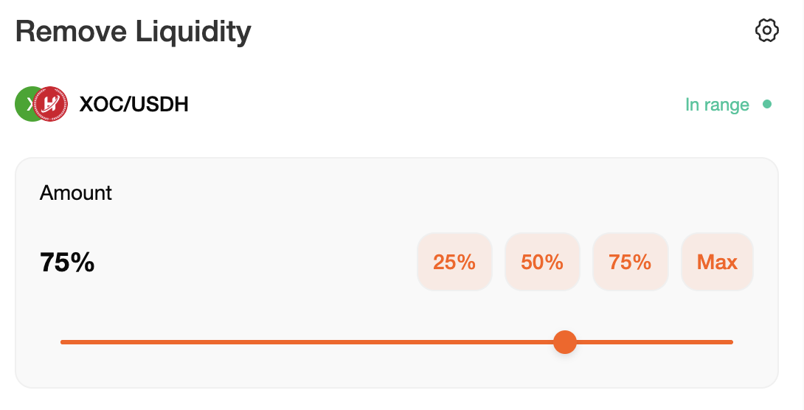
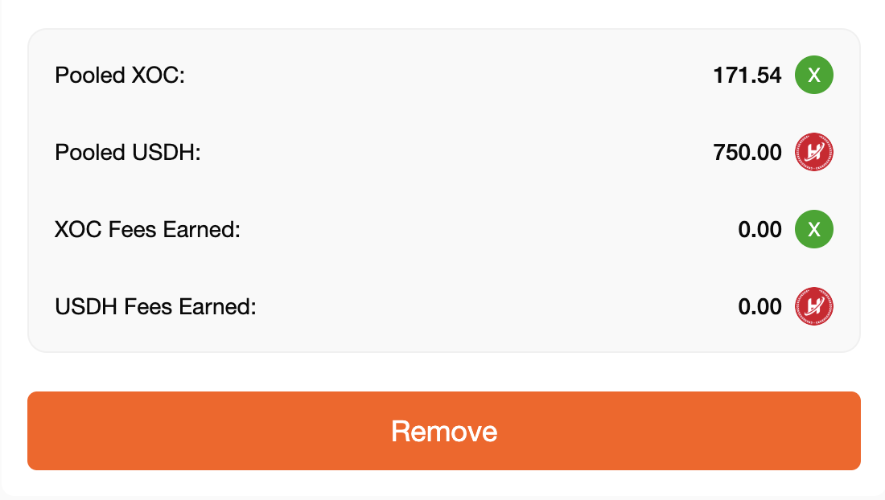

# How to Add/Remove Liquidity

"Liquidity" is the core of how SwapX works. You can add liquidity by staking any token pair through the liquidity page.
In return for adding liquidity, you will receive a trading fee for that token pair. The default fee for swapping tokens is 0.3%, which is allocated by liquidity providers in proportion to their contribution to the liquidity reserve. Liquidity providers can also choose two other fee tiers of 0.05% and 1% when adding liquidity.

## Exchange

To provide liquidity, you need to stake a certain amount of any token pair. The minimum value of the two tokens (in USD) will determine the maximum liquidity you can provide.

You can easily trade any token you need.

In this example, we will use XOC and USDH to add liquidity.

1 Visit the [Pools](https://swapx.exchange/zh/pools) page.

2 Click the "Add Liquidity" button.

3 Using the input box in the upper left corner, select the two tokens in the trading pair you want to add liquidity to. Here, we will use XOC and USDH as an example.

4. You can confirm the fee tier of the liquidity pool you provide by looking at the "Hide" button.

* If you want to customize the fee tier, click "Hide" and select the desired fee tier.

* Please note that it is always recommended to provide liquidity at the most popular fee tier.

5 Enter the amount of one of the tokens under "Deposit Amount". The amount of the other token will be automatically calculated and filled. If the balance of one of the tokens is insufficient, you will see an "Insufficient Balance" error message and the button will be grayed out. Please enter a lower amount to continue, or use the "MAX" button to fill in the maximum available value. You can freely set the price period through "Set Price Range". If it exceeds the range of the token you provided, an error will be reported and it cannot be submitted.

6 Click the "Enable USDH" button. If you are adding liquidity of a token for the first time, you may need to click "Enable" for each token in the trading pair. Your wallet will ask you to confirm this action.

7 After the token authorization is completed, the "Preview" button will light up. Click Continue.

8 A new pop-up window will appear to preview your liquidity status. If everything is OK, click "Add" again to continue.

9 Your wallet will ask you to confirm. Please confirm your transaction in your wallet.

10 Soon, you will see the new liquidity status on the "My Holdings" page of the fund pool. You can view its details by clicking on the status.

### **Remove Liquidity**

To remove liquidity, do the following:

1 Visit the [My Positions](https://swapx.exchange/zh/pools) page of the fund pool.

2 Under Your Positions, select the position you want to remove liquidity from. Click the
"Remove Liquidity" button in the upper right corner of the position details page.

3 Click "Remove". A new window will appear.

4 Use the buttons or slider to select the amount of liquidity to remove. Selecting "MAX" will remove all liquidity from this trading pair.

5 Click "Remove" to continue.

6 Click "Remove" and your wallet will ask you to confirm the action.

7 Once the transaction is confirmed, you will receive both tokens in the trading pair. After removing all liquidity, your "My Positions" page will update the status of this liquidity trading pair to "Closed". If you have not removed all liquidity, your remaining liquidity value will be updated on the liquidity page.