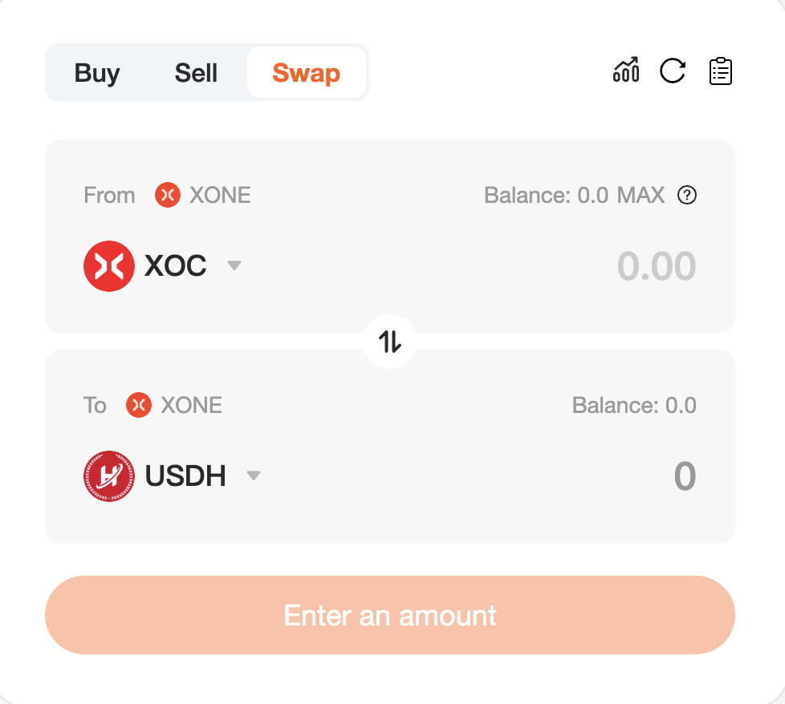

# Token Exchange

Token exchange on decentralized exchanges (DEX) is a peer-to-peer asset exchange achieved through blockchain smart contracts. Its core features and processes are as follows:
## Non-custodial mechanism:
* Users always control private keys through wallets (such as MetaMask)
* Assets do not need to be deposited in exchanges, and smart contracts complete on-chain settlement directly
## Exchange implementation method:
[AMM mode]
Based on liquidity pools (such as Uniswap's x*y=k algorithm)
The price is automatically calculated by the proportion of the capital pool
Exchange formula: Δy = (Δx * y)/(x + Δx)
[Order book mode]
On-chain order matching (such as dYdX)
Buy and sell orders are executed on the chain

[**Token Exchange**](https://swapx.exchange) on SwapX is a simple token exchange method, and liquidity comes from the liquidity pool created on SwapX (https://swapx.exchange/pools).

# Fees
When you swap (trade) tokens on the SwapX exchange, you will pay a transaction fee based on the type of liquidity pool the swap goes through.
## Liquidity Provider Fees
A fee of 0.3% is charged for swapping tokens. This fee is shared by liquidity providers in proportion to their contribution to the liquidity reserve.
Swap fees are immediately deposited into the liquidity reserve. This increases the value of the liquidity tokens as a payment to all liquidity providers in an amount proportional to their share of the pool. Fees are collected by burning liquidity tokens to eliminate a proportional share of the underlying reserve.
## Protocol Fees
There are currently no protocol fees. However, a 0.05% fee may be charged in the future.
In the future, a 0.05% fee on every trade within the protocol may come into effect. This is equivalent to one-⅙ of the 0.30% fee (16.6̅%). If feeTo is not address(0) ( 0x00000000000000000000000000000000000000000000), the fee is valid, indicating that feeTo is the recipient of the fee.
This amount does not affect the fees paid by traders, but does affect the amount received by liquidity providers.