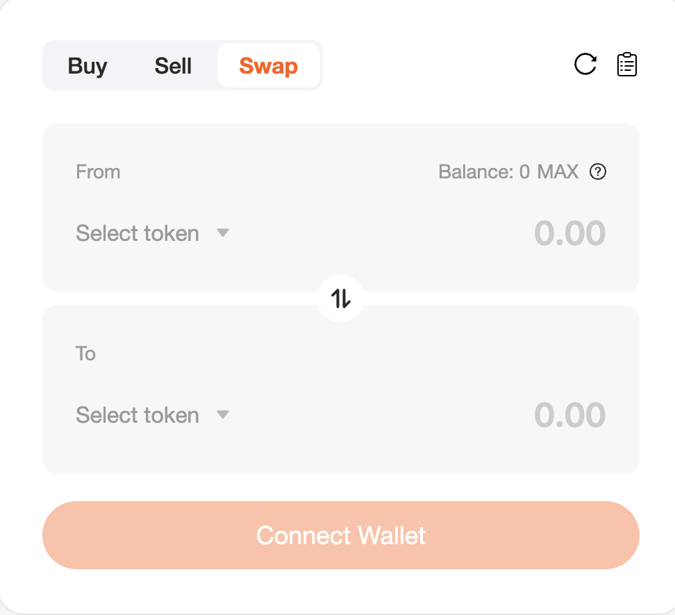
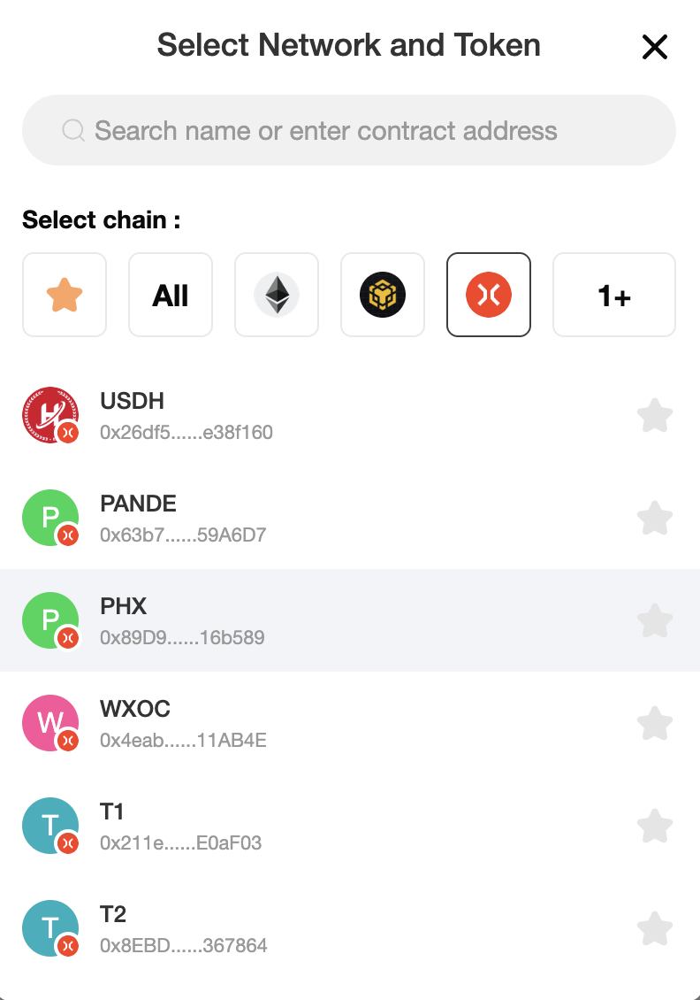

# How to Trade

Trading on SwapX is very simple compared to most exchanges. You won't be bothered by charts or terminology, and the trade routing and calculations are all handled for you by SwapX.

**Trading Setup**

Before you can trade, you'll need a wallet. You can learn how to get one here. You'll also need some Gas to trade. You can learn how to get it here.

## Trading on SwapX Exchange

1 - Go to the exchange page, [click here](https://swapx.exchange).

2 - Unlock your wallet by clicking "Connect Wallet" (you can also click "Connect" in the top right corner). If you haven't connected your wallet to SwapX yet, you can check out the guide here.

3 - Select the token you want to trade from the drop-down menu above. Whichever token you choose, you need to make sure you have enough in your wallet to trade. Your balance is shown above the token drop-down menu.

4 - Select the token you want to trade in the section below, just like above.

5 - Next, enter the amount in the top section, which is the number of tokens you want to exchange (spend amount). Alternatively, enter the amount in the bottom section, which is the number of tokens you want to exchange to (receive amount).
Whichever section you enter the amount in, the amount in the other section will be automatically estimated.

6 - Check all the details and click the **Exchange** button.
If you are trading a token for the first time, you may need to approve it by clicking "Enable XXX (your token)".

7 - A window will appear with more details. Please check that the information is correct. When you are ready, click the "Confirm Exchange" button. Your wallet will ask you to confirm this action.

8 - Now you are Done success! You can view your transaction on the blockchain explorer.