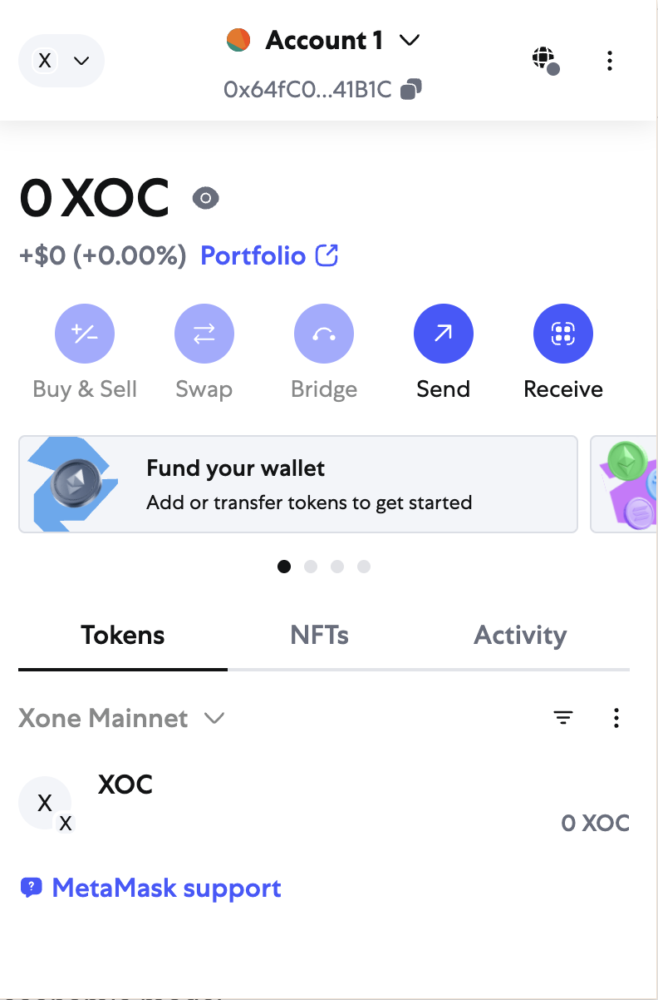

# How to connect and use your wallet
## Get gas fees (XOC)
### What is XOC
    XOC is the native cryptocurrency of Xone Chain, which operates similarly to ETH in the Ethereum ecosystem. Users need to use XOC tokens to interact with Xone Chain, as they are used to pay for gas fees associated with transactions and smart contract interactions. In addition, XOC tokens play a vital role in the network security model, where users can lock tokens through staking to help protect the network and receive corresponding rewards; provide support for decentralized finance (DeFi), smart contracts, and cross-chain applications; and also play an important role in the behavioral value incentive (BVI) economic model.

### How to get XOC
* Buy on exchanges: XOC can be purchased on various centralized exchanges (CEX), where users can exchange XOC with fiat or other cryptocurrencies. It is recommended to store XOC in a wallet that you control for enhanced security.
* Earn XOC through staking: Users can stake XOC to maintain network security and receive staking rewards. You can delegate XOC to a staking provider or run a validation node to earn XOC rewards.
* Cross-chain asset transfer: XOC supports cross-chain asset transfer. You can introduce assets such as ETH and USDT into Xone Chain, exchange them for XOC, or use them within the Xone Chain ecosystem.
* Participate in community activities: Users can also earn XOC by participating in Xone Chain ecosystem activities, such as hackathons, developer challenges, airdrops, etc.

## Add XOC network information

    Network name: Xone Mainnet

    RPC URL: https://rpc.xone.org

    Chain ID: 3721 (0xe89)

    Symbol: XOC

    Block browser URL: https://xscscan.com/

## Use in wallet

Let's start with Metamask as an example:

* Open your Metamask network extension

* Click the network button in the upper left corner and click Add custom network

* After adding the network, you can recharge XOC mainnet. All our chain operations require gas fees~ All wallets need to add the Xone mainnet before they can continue.

* Now let's go to [SwapX](https://swapx.exchange/), connect the wallet to open a new world of swap.

## SwapX supported chains

* Xone Chain (Xone)
* Ethereum Chain (ETH): coming soon
* Binance Smart Chain (BSC): coming soon
* Tron Chain (Tron): coming soon