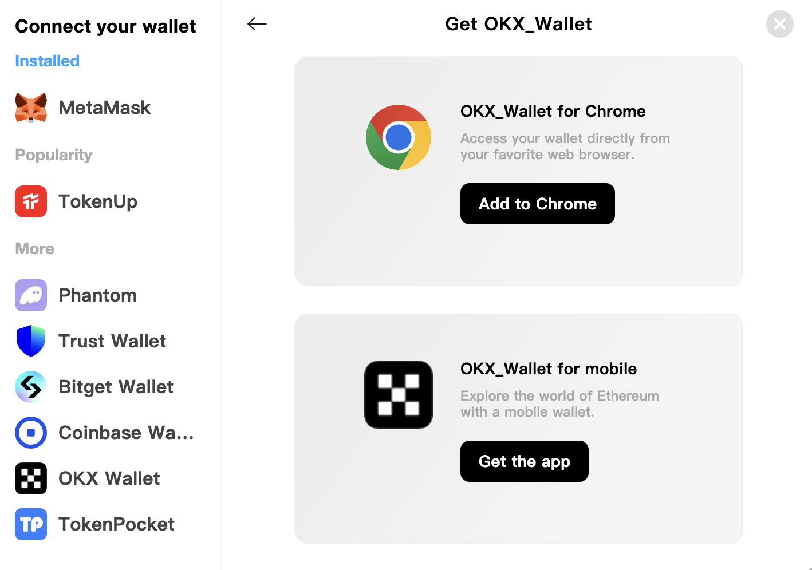

# How to get and create a wallet

## Mobile or desktop wallet?

Mobile device wallets and desktop wallets have their own advantages and disadvantages. Please consider which wallet better suits your needs in order to decide which type of wallet to use.

| | Mobile | Desktop |
| --------------------------------- | ------ | ------- |
| Use anywhere | ✅ | ➖ |
| Easy to use | ✅ | ➖ |
| Safer | ➖ | ✅ |
| Accessibility | ➖ | ✅ |
| Damage/loss/theft proof | ➖ | ✅ |
| Power/connection interruption proof | ✅ | ➖ |

## What wallets does SwapX support?

* MetaMask
* TokenUp
* Trust Wallet
* OKX Wallet
* Coinbase Wallet
* phantom
* Bitget Wallet
* TokenPocket

## How to get it?

### Note⚠️
* ✅ **Please download and install the latest version only from official sources. **
* ✅ **Please follow the setup guide carefully. **
* ✅ **Please back up your recovery phrase safely. **
* ❌ **Never share your recovery phrase with anyone under any circumstances. **
* ❌ **Never enter your recovery phrase into a website or app other than your wallet app. **

### If you don't have a reliable source, please come to us [SwapX](https://swapx.exchange/) to get it!

* Visit [SwapX](https://swapx.exchange/) and click the "Connect Wallet" button in the upper right corner

    
* Click the "Get a Wallet" button

* Click the "Get Wallet" button of the wallet you want to get

* Select the type of wallet you want to use and install it

If you have already installed the wallet, then let's [go here](../wallet_guide/connect_wallet.EN.md) to learn how to use it!