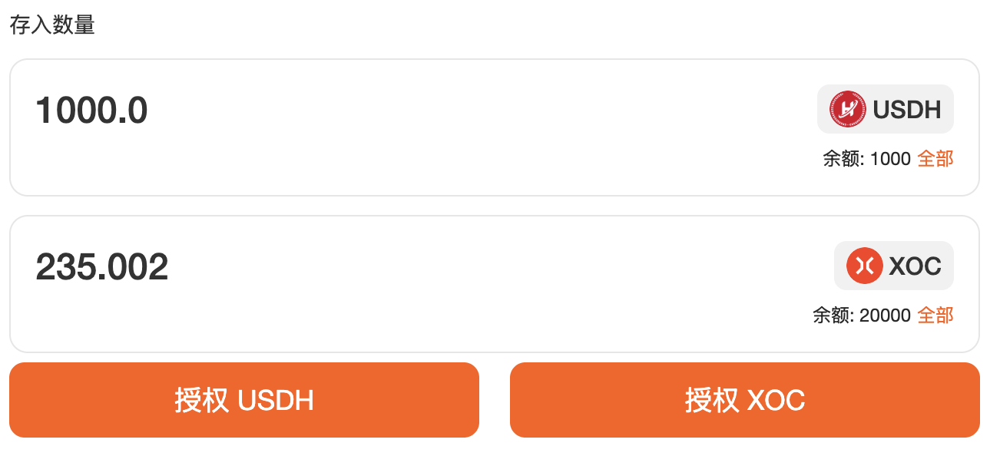
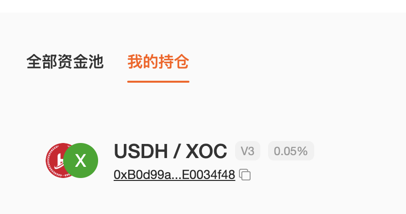
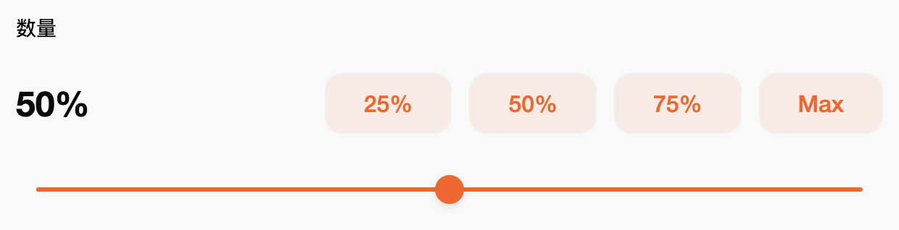
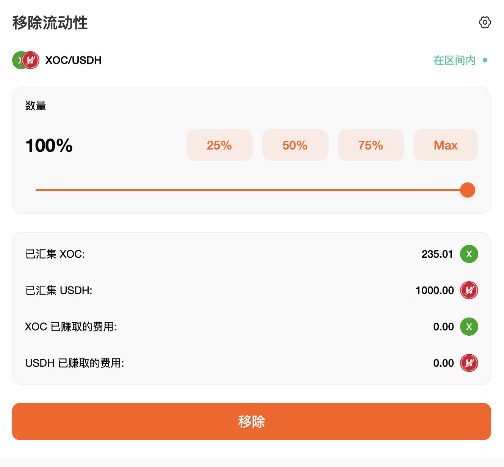

# 如何添加/移除流动性

    “流动性”是 SwapX 交易所运作的核心。您可以通过流动性页面质押任意代币对来增加流动性。
    作为增加流动性的回报，您将获得该代币对的交易手续费，兑换代币默认需支付 0.3% 的费用，该费用由流动性提供者根据其对流动性储备的贡献按比例分配。同时，流动性提供者添加流动性时还可以选择其他0.05%和1%两个费用等级。

## 交易所 

为了提供流动性，您需要投入一定数量的任意代币对。两种代币的最低价值（以美元计）将决定您所能提供的流动性上限。
您可以轻松交易任何您需要的代币。

在本例中，我们将使用 XOC 和 USDH 添加流动性。

1 访问[资金池](https://swapx.exchange/zh/pools)页面。

2 点击“添加流动性”按钮。

3 使用左上角的输入框，选择您想要添加流动性的交易对中的两个代币。这里，我们将以 XOC 和 USDH 为例。

4.您可以通过查看“隐藏”按钮来确认您提供的流动性池的费用等级。

* 如果您想自定义费用等级，请点击“隐藏”，然后选择所需的费用等级。
* 请注意，始终建议按最受欢迎的费用等级提供流动性。

5 在“存入数量”下输入其中一个代币的金额。另一个代币的金额将自动计算并填充。如果其中一个代币的余额不足，您将看到“余额不足”错误消息，并且该按钮将变灰。请输入较低的金额以继续，或使用“MAX”按钮填写最大可用值。您可以通过“设置价格区间”自由设置价格期间，如果超出您提供代币的区间，将会报错且无法提交。

6 点击“启用USDH”按钮。如果您首次添加代币的流动性，则可能需要为交易对中的每个代币点击“启用”。您的钱包会要求您确认此操作。

7 启用代币授权完成后，“预览”按钮将亮起。点击继续。

8  将出现一个新的弹出窗口，用于预览您的流动性状况。如果一切正常，请再次点击“添加”继续。

9 您的钱包会要求您确认。请在您的钱包中确认您的交易。

10 不久之后，您将在资金池“我的持仓”页面上看到新的流动性状况。您可以通过点击该状况查看其详情。

### **移除流动性**

要移除流动性，请执行以下操作：

1 访问资金池 [我的持仓](https://swapx.exchange/zh/pools) 页面。

2 在您的持仓下，选择点击您想要移除流动性的仓位。在持仓详情页面右上角点击
“移除流动性”按钮。

3 点击“移除”。将出现一个新窗口。

4 使用按钮或滑块选择要移除的流动性数量。选择“MAX”将从该交易对中移除所有流动性。

5 点击“移除”继续。

6 点击“移除”，您的钱包会要求您确认操作。

7 交易确认后，您将收到该交易对中的两个代币。移除所有流动性后您的“我的持仓”页面将更新此流动性交易对状态为”已关闭“，如果您尚未移除所有流动性，您的剩余流动性值将在流动性页面上更新。

