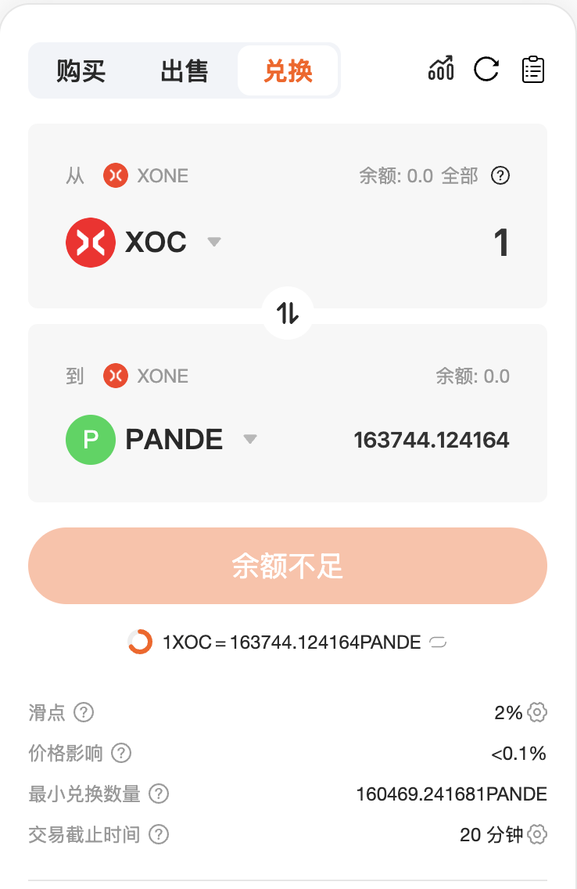

# 如何交易

与大多数交易所相比，在 SwapX 上交易非常简单。您不会被图表或术语所困扰，交易路线和计算都由 SwapX 为您处理。

**交易设置**

在进行交易之前，您需要一个钱包。您可以在[此处了解](../../../study/start/wallet_guide(XOC)/create_wallet.md)如何获取钱包。您还需要一些 Gas 进行交易。您可以在[此处了解](../../../study/start/wallet_guide(XOC)/connect_wallet.md)如何获取。

## 在 SwapX 交易所进行交易

1 - 前往交易所页面，[点击此处](https://swapx.exchange)。

2 - 点击“连接钱包”解锁您的钱包（您也可以点击右上角的“连接”）。如果您尚未将钱包连接到 SwapX，您可以[此处了解](../../../study/start/wallet_guide(XOC)/connect_wallet.md)查看指南。

3 - 从上方下拉菜单中选择您想要交易的代币。无论您选择哪种代币，都需要确保您的钱包中有足够的代币进行交易。您的余额显示在代币下拉菜单上方。

4 - 像上面一样，在下面部分中选择您想要交易的代币。

5 - 接下来，在上方输入金额，即您想要兑换的代币数量（支出金额）。或者，在下方输入金额，即您想要兑换成的代币数量（接收金额）。
无论您在哪个部分输入金额，另一个部分的金额都会自动估算。

6 - 检查所有详细信息，然后点击**兑换**按钮。
如果您是首次交易代币，可能需要先点击“启用 XXX（您的代币）”进行批准。

7 - 系统将出现一个包含更多详细信息的窗口。请检查信息是否正确。准备就绪后，点击“确认兑换”按钮。您的钱包会要求您确认此操作。

8 - 完成！您可以在区块链浏览器上查看您的交易。

