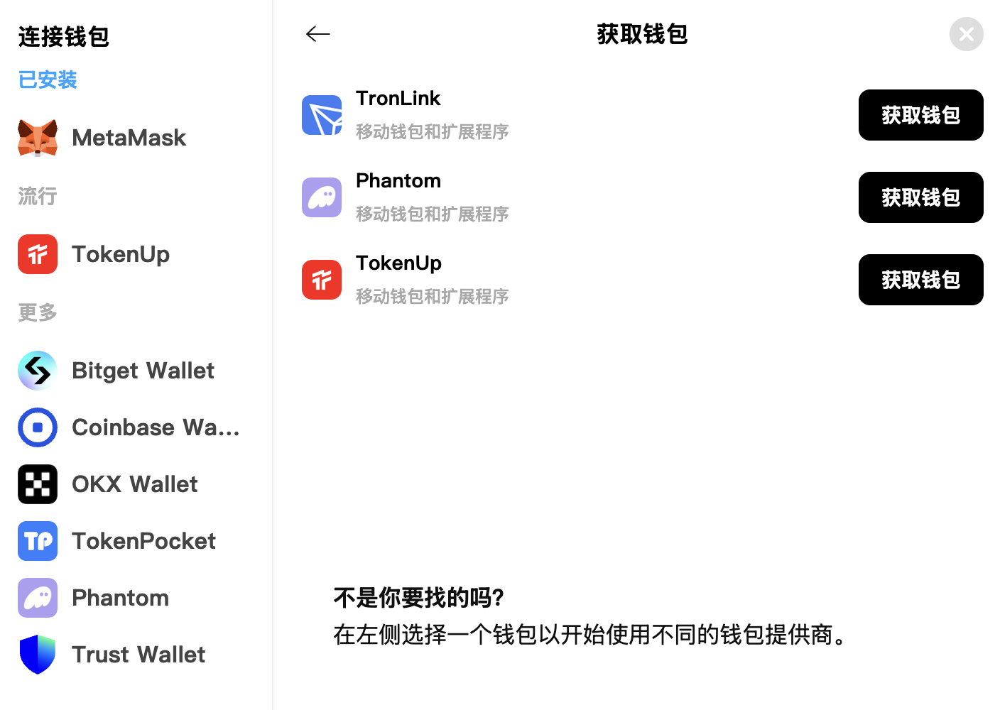
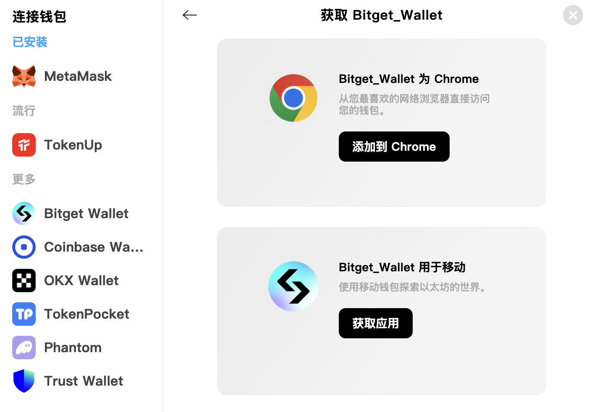

# 如何获取并创建钱包

## 移动钱包还是桌面钱包？

移动设备钱包和桌面钱包各有优缺点。请考虑哪种钱包更符合您的需求，以便决定使用哪种类型的钱包。

| | 移动 | 桌面 |
| --------------------------------- | ------ | ------- |
| 随时随地使用 | ✅ | ➖ |
| 易于使用 | ✅ | ➖ |
| 更安全 | ➖ | ✅ |
| 无障碍访问 | ➖ | ✅ |
| 防损坏/丢失/盗窃 | ➖ | ✅ |
| 防电源/连接中断 | ✅ | ➖ |

## SwapX支持哪些钱包？

* MetaMask 
* TokenUp  
* Trust Wallet  
* OKX Wallet
* Coinbase Wallet
* phantom
* Bitget Wallet
* TokenPocket

## 如何获取？

### 注意⚠️
  * ✅ **请仅从官方来源下载并安装最新版本。**
  * ✅ **请仔细遵循设置指南。**
  * ✅ **请安全备份您的恢复短语。**
  * ❌ **在任何情况下，切勿与任何人分享您的恢复短语。**
  * ❌ **切勿将您的恢复短语输入到钱包应用以外的网站或应用。**
 
### 如果您没有可靠来源，请来我们[SwapX](https://swapx.exchange/)获取吧！

* 访问[SwapX](https://swapx.exchange/)并点击右上角“连接钱包”按钮

  
* 点击“获取钱包”按钮
  
* 点击您想获取的钱包的“获取钱包”按钮
  
* 选择您想使用的钱包种类并安装
  

如果您已经安装好钱包了，那么我们[去这里](../wallet_guide/connect_wallet.md)学习一下如何使用吧！
